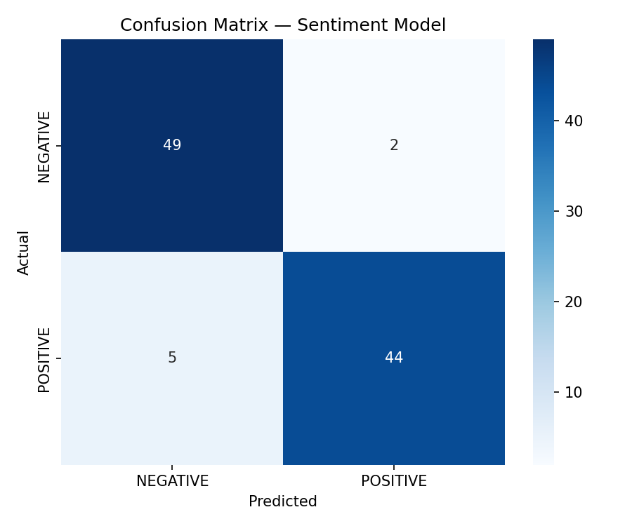

# 🛍️ pranalyzer — Product Review Analyzer

[](https://python.org)
[](https://huggingface.co/Ved2001/pranalyzer)
[](https://gradio.app)
[](LICENSE)

An end-to-end NLP pipeline that analyzes Amazon product reviews using **4 models running in parallel** — giving you sentiment, category, aspects, and a summary in one click.



---

## 🚀 Live Demo

> Coming soon on HuggingFace Spaces

---

## 🧠 Models Used

| Task | Model | Approach |
|---|---|---|
| Sentiment Analysis | `DistilBERT` fine-tuned on Amazon Polarity | Supervised fine-tuning |
| Category Classification | `facebook/bart-large-mnli` | Zero-shot classification |
| Aspect Analysis | `cross-encoder/nli-roberta-base` | Zero-shot classification |
| Summarization | `facebook/bart-large-xsum` | Abstractive summarization |

---

## 📊 Model Performance

Fine-tuned DistilBERT on 5,000 Amazon reviews:

| Metric | Score |
|---|---|
| Accuracy | 93.00% |
| F1 Score | 0.9299 |
| Loss | 0.1923 |

Training details:
- Dataset: `amazon_polarity` (3.6M reviews, sampled 5K)
- Epochs: 3
- Batch size: 32
- Learning rate: 2e-5
- Hardware: T4 GPU (Google Colab)

---

## 🗂️ Project Structure
```
product-review-analyzer/
├── data/                   # Raw data (gitignored)
├── logs/                   # Training & inference logs
├── models/                 # Local model weights
├── notebooks/              # Experiment notebooks
│   └── product_review_analysis.ipynb
├── outputs/                # Evaluation plots
│   └── confusion_matrix.png
├── src/                    # Modular source code
│   ├── __init__.py
│   ├── logger.py           # Logging setup
│   ├── data_loader.py      # Dataset loading
│   ├── preprocessing.py    # Tokenization pipeline
│   ├── train.py            # Fine-tuning DistilBERT
│   ├── evaluate.py         # Evaluation + confusion matrix
│   └── predict.py          # All 4 model inference
├── app.py                  # Gradio demo
├── requirements.txt
└── README.md
```

---

## ⚙️ How to Run Locally

**1. Clone the repo**
```bash
git clone https://github.com/Vedant-Nagarkar/product-review-analyzer.git
cd product-review-analyzer
```

**2. Create virtual environment**
```bash
python -m venv pranalyzer
pranalyzer\Scripts\activate      # Windows
# source pranalyzer/bin/activate  # Mac/Linux
```

**3. Install dependencies**
```bash
pip install -r requirements.txt
```

**4. Download model weights**
```bash
python -c "from huggingface_hub import snapshot_download; snapshot_download(repo_id='Ved2001/pranalyzer', local_dir='./models/sentiment-model')"
```

**5. Run the Gradio app**
```bash
python app.py
```

Open `http://localhost:7860` in your browser.

---

## 🧪 Run Individual Modules
```bash
# Test logger
python -m src.logger

# Test data loading
python -m src.data_loader

# Test preprocessing
python -m src.preprocessing

# Run evaluation
python -m src.evaluate

# Test all 4 models
python -m src.predict
```

---

## 🔍 Example Output

Given this review:
> *"I bought this iPhone case three months ago and I am extremely happy with it. The material feels premium and it has protected my phone from two accidental drops. The price is a bit high but the quality justifies it."*

pranalyzer outputs:

| Field | Output |
|---|---|
| 😊 Sentiment | POSITIVE (98.4%) |
| 📦 Category | Electronics |
| 🔍 Aspects | design and appearance (1.00), quality and durability (0.98), price and value (0.98) |
| 📝 Summary | I bought this iPhone case three months ago and it has been a lifesaver! |

---

## 🛠️ Tech Stack

- **Python 3.11**
- **HuggingFace Transformers 5.0.0**
- **PyTorch 2.6.0**
- **Gradio 5.50**
- **Datasets 4.0.0**
- **scikit-learn 1.6.1**

---

## 👤 Author

**Vedant Nagarkar**
[](https://huggingface.co/Ved2001)
[](https://github.com/Vedant-Nagarkar)
[](https://linkedin.com/in/vedant-nagarkar)
```

---

Once you've replaced the README, check your `.gitignore` before pushing. Make sure these are in it:
```
pranalyzer/
models/
data/
logs/
__pycache__/
*.pyc
.env